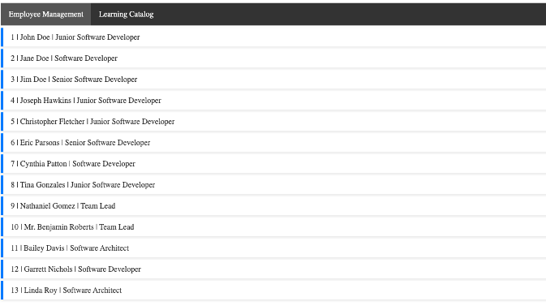
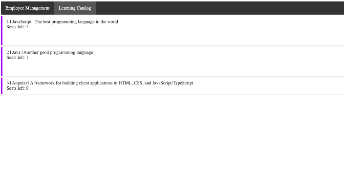
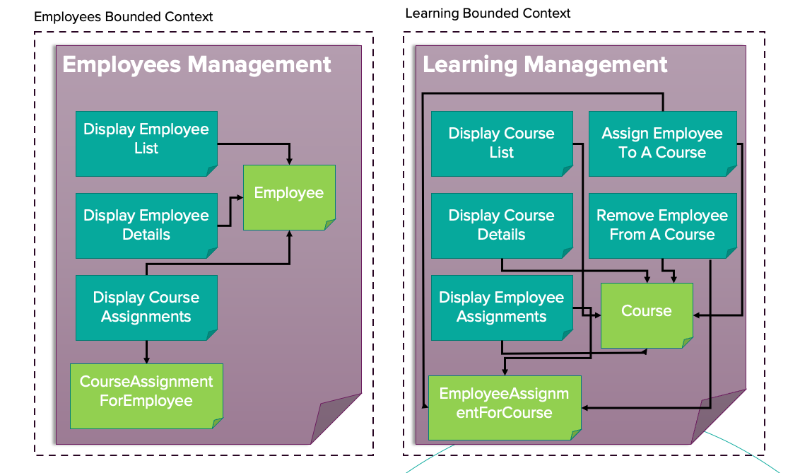
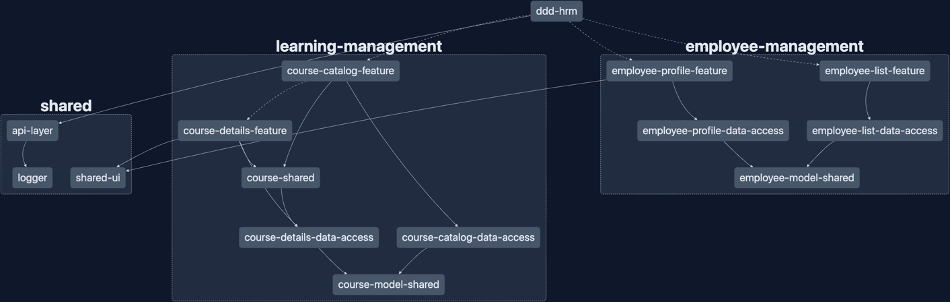

It's "real-life" example of the strategic DDD in the frontend. It's a simple application that show how to implement DDD strategic solution utilizing NX Workspace

The separate domain correspond to the two views as below:

Repository shows how to define explicitly the bounded contexts and how to separate it from the infrastructure. It's a simple application that shows how to separate two core domains: Employee Management and Learning Management.

Utilizing the NX Workspace tooling like @nx/enforce-module-boundaries rule, the example of layering the application is also presented. 
The entire architecture is based on the DDD principles and some takewayes from the Clean Architecture.

The repository has been created for a knwledge sharing purpose and it's a part of the presentation about the strategic DDD in the frontend. 

How to run the application:

`npm run start`
